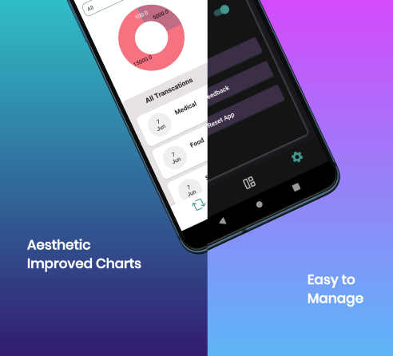
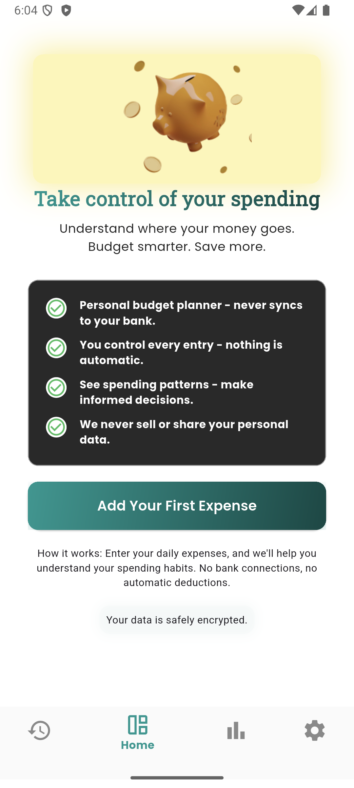
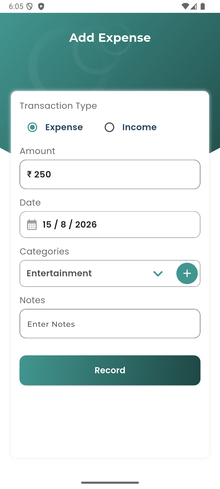
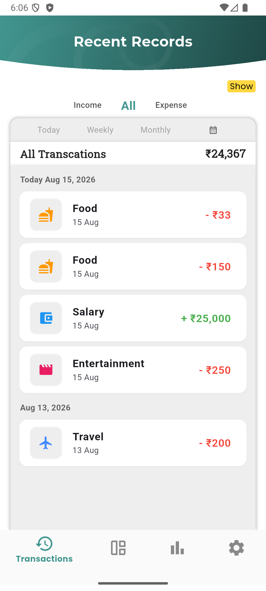
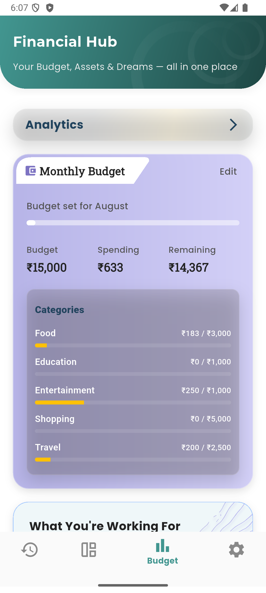
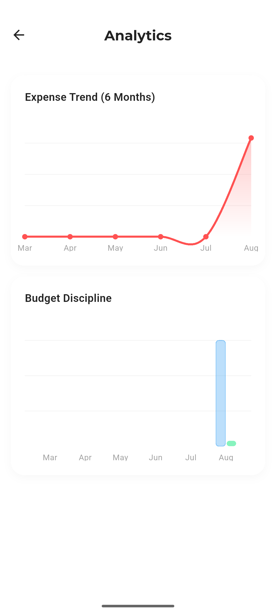
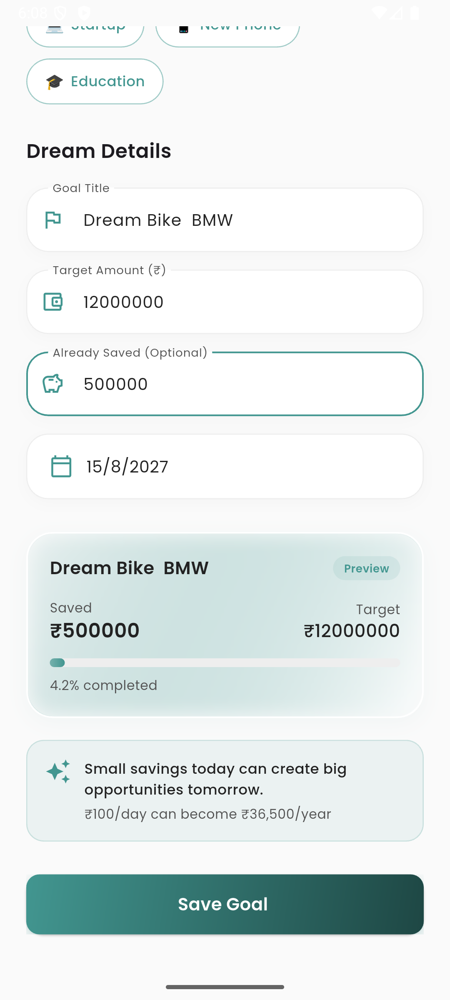
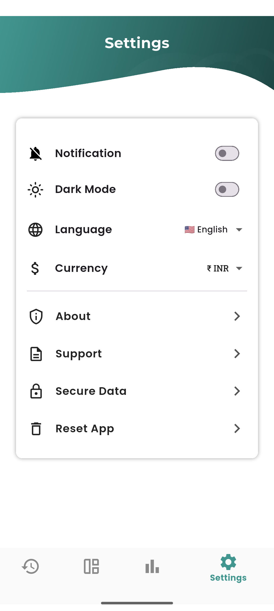
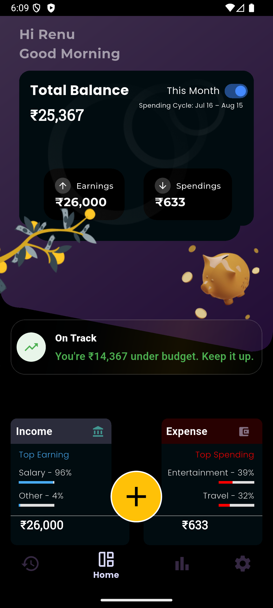
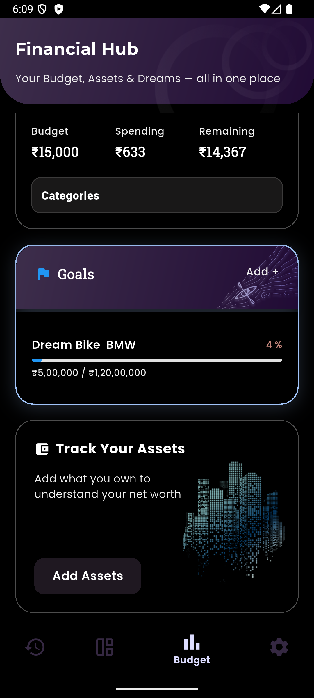

# 💜 Mono – Personal Finance

> Track where your money goes.

Mono is a modern, offline-first personal finance application built with Flutter. It helps users record income and expenses, manage budgets, analyze spending patterns, and achieve financial goals through a clean and intuitive experience.

---

## 📱 Platforms

- ✅ Android
- ✅ Web (Firebase Hosting)

---

## ✨ Features

### 💰 Money Management
- Add income & expenses
- Categorize transactions
- Search & filter transactions
- Monthly cash flow tracking

### 📊 Analytics
- Expense insights
- Income vs Expense
- Category breakdown
- Monthly trends

### 🎯 Dreams & Goals
- Create financial goals
- Track saved amount
- Target amount & deadline
- Progress visualization

### 💳 Budget
- Monthly budget planning
- Budget usage tracking
- Remaining balance

### 🌍 Localization
- Multiple language support
- Easy language switching

### 🔒 Security
- Offline-first architecture
- Local data persistence
- Firebase integration

---

# 🛠 Tech Stack

| Technology | Usage |
|------------|-------|
| Flutter | Cross-platform development |
| Dart | Programming language |
| Provider | State Management |
| Hive | Local Database |
| Firebase | Hosting & Services |
| GitHub Actions | CI/CD |
| Material 3 | UI Design |

---

# 📸 Screenshots




| Home | Analytics | Goals |
|------|-----------|-------|
|  |  |  |
|  |  |  |
|  |  |  |

---

# 🌐 Live Demo

Web App

https://mono-b47e2.web.app

---

# 🧪 CI/CD

GitHub Actions automatically:

- Flutter Analyze
- Build Release APK
- Build Release AAB
- Upload Build Artifacts

---

# 📂 Project Structure

```
lib/
│
├── core/
├── features/
│   ├── home/
│   ├── transactions/
│   ├── budget/
│   ├── dreams/
│   ├── analytics/
│   └── settings/
│
├── shared/
├── services/
├── widgets/
└── main.dart
```

---

# 🗺 Roadmap

- [x] Expense Tracking
- [x] Income Tracking
- [x] Budget Planning
- [x] Analytics
- [x] Dreams & Goals
- [x] Firebase Hosting
- [x] Android Release
- [ ] Cloud Backup
- [ ] Recurring Transactions
- [x] AI Spending Insights
- [ ] PDF Reports
- [x] Export & Import
- [ ] iOS Support
- [x] web support

---

# 🤝 Contributing

Contributions, feature requests, and bug reports are welcome.

Feel free to open an Issue or submit a Pull Request.

---

# 📄 License

This project is licensed under the MIT License.

---

## 👨‍💻 Developer

**Muhammed Rafi**

Flutter Developer

Made with ❤️ using Flutter.
